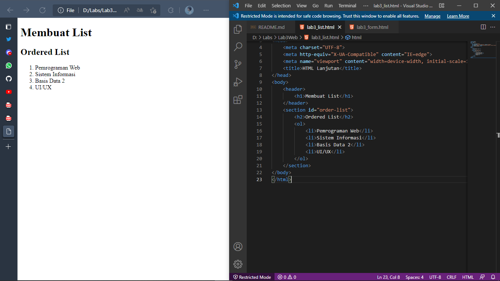

# Lab3Web

|   INDIRA ALINE    |   312010042       |
| ----------------- | ----------------- |
|   TI.20.A.1       | PEMROGRAMAN WEB   |
| PERTEMUAN 4       |       HTML        |

Di Pertemuan kali ini akan mempelajari bagaimana **MEMBUAT LIST**,**TABLE** dan **FORM** dengan HTML.

## 1). CREATE ORDERED LIST
### Output

**PENJELASAN**
***ORDERED LIST*** adalah **LIST** yang sudah terdaftar sesuai urutan atau **LIST** yang terurut seperti dengan tag HTML nya yaitu **ol** contoh gambar di atas,**LIST** nya terurut sesuai nomor.
**CODE HTML**
```html
<!DOCTYPE html>
<html lang="en">
<head>
    <meta charset="UTF-8">
    <meta http-equiv="X-UA-Compatible" content="IE=edge">
    <meta name="viewport" content="width=device-width, initial-scale=1.0">
    <title>HTML Lanjutan</title>
</head>
<body>
    <header>
        <h1>Membuat List</h1>
    </header>
    <section id="order-list">
        <h2>Ordered List</h2>
        <ol>
            <li>Pemrograman Web</li>
            <li>Sistem Informasi</li>
            <li>Basis Data 2</li>
            <li>UI/UX</li>
        </ol>
    </section>
</body>
</html>
```