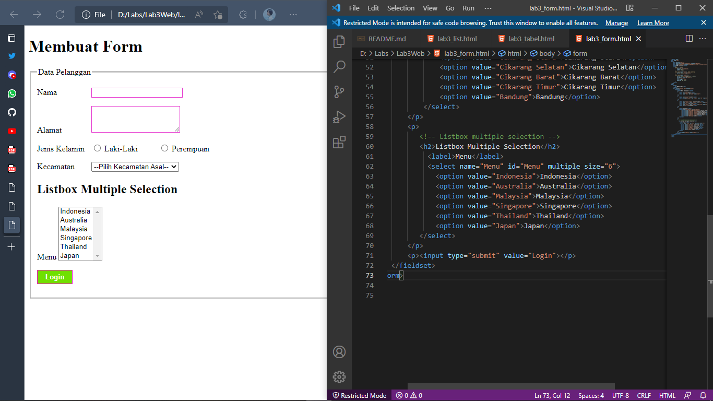

# Lab3Web

|   INDIRA ALINE    |   312010042       |
| ----------------- | ----------------- |
|   TI.20.A.1       | PEMROGRAMAN WEB   |
| PERTEMUAN 4       |       HTML        |

DiPertemuan kali ini akan mempelajari bagaimana **MEMBUAT LIST**,**TABLE** dan **FORM** dengan HTML.

## 1). CREATE ORDERED LIST
### Output

***ORDERED LIST*** adalah **LIST** yang sudah terdaftar sesuai urutan atau **LIST** yang terurut seperti dengan tag HTML nya yaitu **ol** contoh gambar di atas,**LIST** nya terurut sesuai nomor.

**CODE HTML**
```html
<!DOCTYPE html>
<html lang="en">
<head>
    <meta charset="UTF-8">
    <meta http-equiv="X-UA-Compatible" content="IE=edge">
    <meta name="viewport" content="width=device-width, initial-scale=1.0">
    <title>HTML Lanjutan</title>
</head>
<body>
    <header>
        <h1>Membuat List</h1>
    </header>
    <section id="order-list">
        <h2>Ordered List</h2>
        <ol>
            <li>Pemrograman Web</li>
            <li>Sistem Informasi</li>
            <li>Basis Data 2</li>
            <li>UI/UX</li>
        </ol>
    </section>
</body>
</html>
```

## 2). CREATE UNORDERED LIST
### Output

***UNORDERED LIST*** adalah **LIST** yang tidak terurut atau acak dengan tag HTML nya yaitu **ul** contoh gambar di atas yaitu ***UNORDERED LIST** **LIST** yang tidak terurut dengan 4 **li** atau **LIST** .

**CODE HTML**
```html
<section id="unorder-list">
        <h2>Unordered List</h2>
        <ul type="square">
            <li>Jaringan Komputer</li>
            <li>Struktur Data</li>
            <li>Algoritma & Pemrograman</li>
            <li>Sistem Perangkat Lunak</li>
        </ul>
    </section>
```

## 3). CREATE DESCRIPTION LIST
### Output

**dl** atau ***Description List** adalah sebuah **LIST** yang menunjukan sebuah Deskripsi tertentu dan di dalam **dl** ada **dt** dan **dd**,**dt** sendiri adalah sebuah konten dari istilah sedangkan penjelasan nya ada di **dd** seperti itu urutan dari **dl** atau ***Description List** seperti contoh gambar di atas **dt** nya adalah nama **fakultas** sedangkan **dd** nya adalah **jurusan** .

**CODE HTML**
```html
<section id="unorder-list">
        <h2>Description List</h2>
        <dl>
            <dt>Fakultas Teknik</dt>
            <dd>Teknik Industri</dd>
            <dd>Teknik Informatika</dd>
            <dd>Teknik Lingkungan</dd>
            <dt>Fakultas Ekonomi dan Bisnis</dt>
            <dd>Akuntansi</dd>
            <dd>Manajemen</dd>
            <dd>Bisnis Digital</dd>
        </dl>
    </section>
```

## 4). CREATE TABEL 
### Output

***TABLE*** dalam HTML terdiri atas **thead** untuk ***table*** head dan kemudian ***tr*** untuk membuat ***table row*** dan di dalam **thead** ada ***th*** untuk table head nya,sementara untuk **tbody** yaitu table body sama harus di awali ***tr*** dan kemudian disusul **td** yaitu **table data** atau isi Deskripsi sebuah table,Seperti contoh gambar di atas lengkap dengan susunan dalam membuat ***Table***.

**CODE HTML**
```html
<!DOCTYPE html>
<html lang="en">
<head>
    <meta charset="UTF-8">
    <meta http-equiv="X-UA-Compatible" content="IE=edge">
    <meta name="viewport" content="width=device-width, initial-scale=1.0">
    <title>HTML Lanjutan</title>
</head>
<body>
    <header>
        <h1>Membuat Table</h1>
    </header>
    <table border="1" cellpadding="4" cellspacing="0">
        <thead>
            <tr>
                <th>No.</th>
                <th>Fakultas</th>
                <th>Program Studi</th>
            </tr>
        </thead>
        <tbody>
            <tr>
                <td>1.</td>
                <td>Teknik</td>
                <td>Teknik Informatika</td>
            </tr>
            <tr>
                <td>2.</td>
                <td>Teknik</td>
                <td>Teknik Industri</td>
            </tr>
            <tr>
                <td>3.</td>
                <td>Teknik</td>
                <td>Teknik Lingkungan</td>
            </tr>
        </tbody>
    </table>
</body>
</html>
```

## 5). MENGATUR MARGIN DAN PADDING PADA TABLE
Sebelum nya saya memberi cellpadding="4" dan cellspacing="0" 

**CODE SEBELUM NYA** 
```html
 <table border="1" cellpadding="4" cellspacing="0">
```
dan saya ubah ke cellpadding="8" dan cellspacing="0" 

**CODE SETELAH DIUBAH**
```html
<table border="1" cellpadding="8" cellspacing="0">
```   
maka tampilan di browser nya seperti gambar dibawah!
 
Untuk menambahkan margin dan padding pada  cell data tambahkan atribut **cellpadding** dan **cellspacing** seperti gambar di atas saya merubah padding nya agar terlihat ke dalam.

## 6). MENGGABUNGKAN SEL DATA
### Output

Untuk menggabungkan sel data, gunakan atribut ***rowspan*** dan ***colspan***, atribut ***rowspan*** untuk menggabungkan baris (secara vertikal) dan ***colspan*** untuk menggabungkan kolom (secara horizontal).

**CODE HTML**
```html
<table border="1" cellpadding="8" cellspacing="0">
        <thead>
            <tr>
                <th>No.</th>
                <th>Fakultas</th>
                <th>Program Studi</th>
            </tr>
        </thead>
        <tbody>
            <tr>
                <td>1.</td>
                <td rowspan="3">Teknik</td>
                <td>Teknik Informatika</td>
            </tr>
            <tr>
                <td>2.</td>
                <td>Teknik Industri</td>
            </tr>
            <tr>
                <td>3.</td>
                <td>Teknik Lingkungan</td>
            </tr>
        </tbody>
    </table>
```

## 7). CREATE FORM
### Output

Untuk membuat **form** pada HTML menggunakan tag **form** kemudian tambahkan **fieldset** dan juga **legend** namun formal nya hanya **form** **label** dan ***input*** saja untuk pilihan ***input*** terdapat banyak pilihan sesuai kebutuhan coding.

**CODE HTML**
```html
<!DOCTYPE html>
<html lang="en">
<head>
    <meta charset="UTF-8">
    <meta http-equiv="X-UA-Compatible" content="IE=edge">
    <meta name="viewport" content="width=device-width, initial-scale=1.0">
    <title>HTML Lanjutan</title>
</head>
<body>
    <header>
        <h1>Membuat Form</h1>
    </header>
    <form action="proses.php" method="post">
        <fieldset>
            <legend>Data Pelanggan</legend>
            <p>
                <label for="nama">Nama</label>
                <input type="text" id="nama" name="nama">
            </p>
            <p>
                <label for="alamat">Alamat</label>
                <textarea name="alamat" id="alamat" cols="20" rows="3"></textarea>
            </p>
            <p>
                <label for="jenis kelamin">Jenis Kelamin</label>
                <input type="radio" name="kelamin" id="jk_l" value="L"> 
                <label for="jk_l">Laki-Laki</label>
                <input type="radio" name="kelamin" id="jk_p" value="P">
                <label for="jk_p">Perempuan</label>
            </p>
            <p><input type="submit" value="Login"></p>
        </fieldset>
    </form>
</body>
</html>
```

## 8). MENAMBAHKAN STYLE PADA FORM
### Output

**PENJELASAN** 
Disini sedikit menambahkan CSS ***INTERNAL*** pada tampilan **form** di HTML seperti gambar di atas.

**CODE CSS NYA**
```css
<style>
        form p > label{
            display: inline-block;
            width: 100px;
        }
        form input[type="text"], form textarea{
            border: 1px solid #e639cf;
        }
        form input[type="submit"]{
            border: 1px solid rgb(255, 0, 212);
            background-color: #70e000 ;
            color: #ffffff;
            font-weight: bold;
            padding: 5px 15px;
        }
    </style>
```

## PERTANYAAN DAN TUGAS!
### 1). Buatlah form yang menampilkan ***dropdown*** menu dan ***listbpx*** dengan *multiple selection*

**DROPDOWN**
ini adalah contoh **DROPDOWN** menu seperti contoh gambar di bawah!

di atas addalah contoh dari **Dropdown** menu dengan menggunakan tag **Select** dan **Option** sebagai opsi dalam memilih,sebagai contoh di atas saya memiliki opsi untuk memilih kecamatan asal.

**CODE HTML**
```html
<p>
    <label>Kecamatan</label>
        <select name="kecamatan" id="kecamatan">
            <option value="Pilih Kecamatan Asal">--Pilih Kecamatan Asal--<option>
            <option value="Cikarang Utara">Cikarang Utara</option>
            <option value="Cikarang Selatan">Cikarang Selatan</option>
            <option value="Cikarang Barat">Cikarang Barat</option>
            <option value="Cikarang Timur">Cikarang Timur</option>
            <option value="Bandung">Bandung</option>
        </select>
</p>
```

***listbox multiple selection***
ini adalah contoh dari ***listbox multiple selection***

di atas adalah contoh dari ***listbox Multiple Selection*** kita bisa memilih lebih dari satu atau juga disebut **Multi Select** 

**CODE HTML**
```html
            <p>
               <!-- Listbox multiple selection -->
               <h2>Listbox Multiple selection</h2>
                <label>Menu</label>
                <select name="Menu" id="Menu" multiple size="6">
                    <option value="Indonesia">Indonesia</option>
                    <option value="Australia">Australia</option>
                    <option value="Malaysia">Malaysia</option>
                    <option value="Singapore">Singapore</option>
                    <option value="Thailand">Thailand</option>
                    <option value="Japan">Japan</option>
                </select>
            </p>
```

## TERIMA KASIH